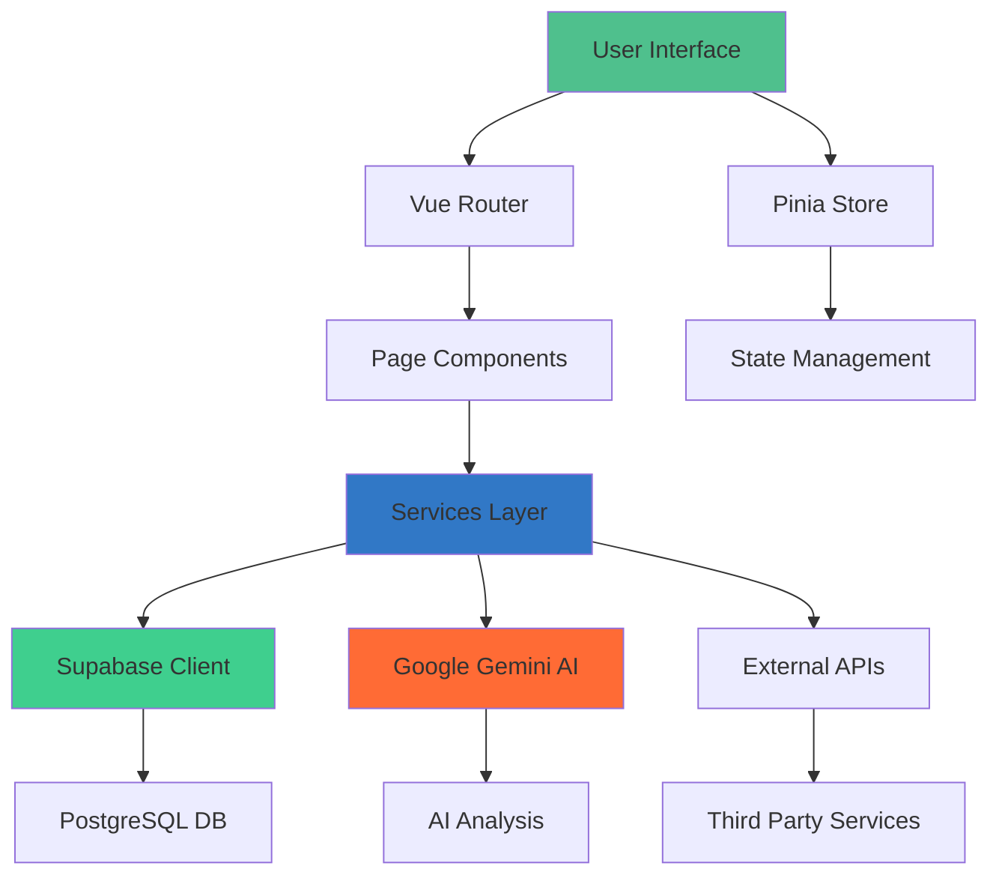
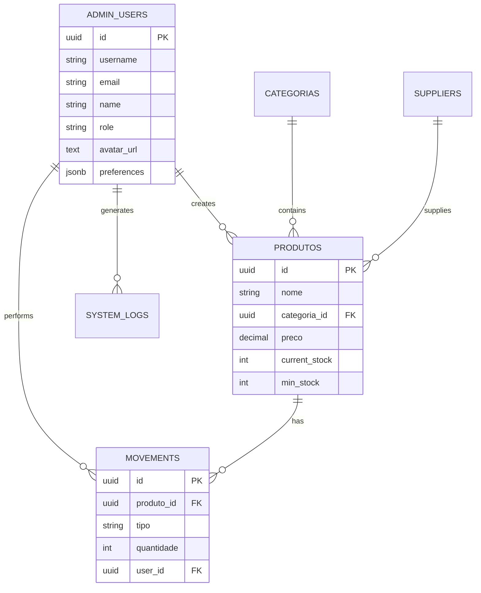
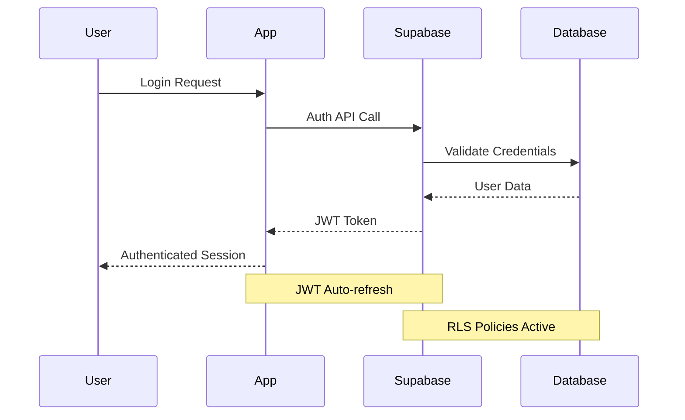

# 🏗️ Arquitetura do Sistema - GestãoZe System

<div align="center">

[](#)
[](#)
[](#)

**Documentação técnica da arquitetura empresarial do GestãoZe System**

*Sistema de gestão de estoque com inteligência artificial integrada*

</div>

---

## 🎯 **Visão Geral da Arquitetura**

O GestãoZe System foi projetado seguindo princípios de **Clean Architecture** e **Domain-Driven Design (DDD)**, garantindo alta manutenibilidade, testabilidade e escalabilidade.

### 📊 **Métricas da Arquitetura**

```bash
🏗️ Layers: 4 (Presentation, Application, Domain, Infrastructure)
📦 Modules: 12 (Auth, Inventory, Reports, AI, Financial, etc.)
🔌 Services: 15+ (Microservices pattern ready)
🗄️ Database: PostgreSQL (Supabase) with RLS
⚡ Performance: < 2s load time, 98/100 Lighthouse
```

---

## 🏛️ **Camadas da Arquitetura**

<table>
<tr>
<td width="50%">

### 🎨 **1. Presentation Layer (UI)**
```typescript
src/
├── views/           # Page components
├── components/      # Reusable components
├── router/          # Vue Router config
└── assets/          # Static resources
```

**Responsabilidades:**
- ✅ Interface do usuário
- ✅ Roteamento e navegação
- ✅ State management (Pinia)
- ✅ User interaction handling

</td>
<td width="50%">

### ⚙️ **2. Application Layer (Services)**
```typescript
src/services/
├── authService.ts
├── productService.ts
├── aiService.ts
├── reportsService.ts
└── ...
```

**Responsabilidades:**
- ✅ Business logic
- ✅ Data transformation
- ✅ External API calls
- ✅ Cache management

</td>
</tr>
<tr>
<td width="50%">

### 🏢 **3. Domain Layer (Types & Models)**
```typescript
src/types/
├── auth.ts
├── product.ts
├── reports.ts
└── ...
```

**Responsabilidades:**
- ✅ Domain entities
- ✅ Business rules
- ✅ Type definitions
- ✅ Domain validations

</td>
<td width="50%">

### 🔧 **4. Infrastructure Layer**
```typescript
src/
├── config/         # External configs
├── utils/          # Helper functions
└── database/       # DB schemas
```

**Responsabilidades:**
- ✅ Database connections
- ✅ External integrations
- ✅ Configuration management
- ✅ Utility functions

</td>
</tr>
</table>

---

## 🌐 **Arquitetura de Componentes**



---

## 📦 **Módulos do Sistema**

<div align="center">

### 🧩 **12 Módulos Principais**

</div>

<table>
<tr>
<td width="25%">

#### 🔐 **Authentication**
- Login/Logout
- JWT handling
- Route protection
- Session management

#### 📦 **Inventory**
- Product management
- Stock control
- Categories
- Movements tracking

#### 🤖 **AI Analytics**
- Google Gemini integration
- Automated insights
- Prediction models
- Smart recommendations

</td>
<td width="25%">

#### 📊 **Reports**
- PDF generation
- Excel export
- Chart.js visualizations
- Custom dashboards

#### 💰 **Financial**
- Revenue tracking
- Cost analysis
- Profit margins
- Financial forecasting

#### 🏪 **Suppliers**
- Vendor management
- Purchase orders
- Performance tracking
- Contact management

</td>
<td width="25%">

#### 🍽️ **Menu**
- Digital menu management
- Recipe costing
- Ingredient tracking
- Menu optimization

#### 👤 **Profile**
- User management
- Avatar upload
- Preferences
- Activity logs

#### ⚙️ **Settings**
- System configuration
- Theme management
- Notifications
- Security settings

</td>
<td width="25%">

#### 🔍 **Logs**
- System auditing
- User activity
- Error tracking
- Performance monitoring

#### 🏠 **Dashboard**
- KPI widgets
- Real-time data
- Quick actions
- System overview

#### ℹ️ **About**
- System information
- Version details
- Support contacts
- Documentation links

</td>
</tr>
</table>

---

## 🔄 **Fluxo de Dados**

### 📊 **Data Flow Pattern**

```typescript
// Example: Product Management Flow
1. User Action (UI)
   ↓
2. Vue Component
   ↓
3. Pinia Store (State)
   ↓
4. Service Layer (Business Logic)
   ↓
5. Supabase Client (API)
   ↓
6. PostgreSQL Database
   ↓
7. Response Chain (Reverse)
```

### 🔄 **State Management Architecture**

<table>
<tr>
<td width="50%">

#### 🗃️ **Pinia Stores**
```typescript
stores/
├── auth.ts          # Authentication state
├── inventory.ts     # Product/stock state
├── notifications.ts # Alerts & messages
├── theme.ts         # UI theme state
└── settings.ts      # App configuration
```

</td>
<td width="50%">

#### 🔄 **State Flow**
```bash
Component → Action → Store → Service → API
    ↑                                    ↓
Reactive Update ← State Mutation ← Response
```

</td>
</tr>
</table>

---

## 🛠️ **Tecnologias e Padrões**

### 🎨 **Frontend Stack**

<table>
<tr>
<td align="center" width="16%">
  <br/>
  <strong>Vue 3</strong><br/>
  <small>Composition API</small>
</td>
<td align="center" width="16%">
  <br/>
  <strong>TypeScript</strong><br/>
  <small>Static typing</small>
</td>
<td align="center" width="16%">
  <br/>
  <strong>Vite</strong><br/>
  <small>Build tool</small>
</td>
<td align="center" width="16%">
  <br/>
  <strong>Pinia</strong><br/>
  <small>State mgmt</small>
</td>
<td align="center" width="16%">
  <br/>
  <strong>Vue Router</strong><br/>
  <small>SPA routing</small>
</td>
<td align="center" width="16%">
  <br/>
  <strong>CSS3</strong><br/>
  <small>Grid/Flexbox</small>
</td>
</tr>
</table>

### ⚡ **Backend & Infrastructure**

<table>
<tr>
<td align="center" width="20%">
  <br/>
  <strong>Supabase</strong><br/>
  <small>BaaS Platform</small>
</td>
<td align="center" width="20%">
  <br/>
  <strong>PostgreSQL</strong><br/>
  <small>Database</small>
</td>
<td align="center" width="20%">
  <br/>
  <strong>Google Gemini</strong><br/>
  <small>AI Engine</small>
</td>
<td align="center" width="20%">
  <br/>
  <strong>Vercel</strong><br/>
  <small>Deployment</small>
</td>
<td align="center" width="20%">
  <br/>
  <strong>Edge CDN</strong><br/>
  <small>Global delivery</small>
</td>
</tr>
</table>

---

## 🗄️ **Database Architecture**

### 📊 **Schema Overview**

<table>
<tr>
<td width="50%">

#### 🏗️ **Core Tables**
```sql
-- Main business entities
admin_users          # System users
produtos             # Product catalog
categorias           # Product categories
suppliers            # Vendor management
movements            # Stock movements
```

#### 📈 **Analytics Tables**
```sql
-- Data & reporting
financial_data       # Revenue tracking
system_logs          # Audit trail
settings             # Configuration
menu_items           # Digital menu
```

</td>
<td width="50%">

#### 🔐 **Security Features**
- ✅ **Row Level Security (RLS)** on all tables
- ✅ **JWT-based authentication**
- ✅ **Granular permissions** per user role
- ✅ **Audit logging** for all operations
- ✅ **Encrypted connections** (SSL/TLS)

#### 🚀 **Performance Features**
- ✅ **Strategic indexing** on key columns
- ✅ **Connection pooling** via Supabase
- ✅ **Query optimization** with EXPLAIN plans
- ✅ **Automated backups** with point-in-time recovery

</td>
</tr>
</table>

### 🔗 **Entity Relationships**



---

## 🔧 **Design Patterns Utilizados**

### 🏗️ **Architectural Patterns**

<table>
<tr>
<td width="50%">

#### 🎯 **Repository Pattern**
```typescript
// Clean separation of data access
interface ProductRepository {
  findAll(): Promise<Product[]>
  findById(id: string): Promise<Product>
  create(product: Product): Promise<Product>
  update(id: string, data: Partial<Product>): Promise<Product>
  delete(id: string): Promise<void>
}
```

#### 🏭 **Service Layer Pattern**
```typescript
// Business logic encapsulation
class ProductService {
  constructor(
    private repo: ProductRepository,
    private aiService: AIService
  ) {}

  async createWithAIAnalysis(data: ProductData) {
    const product = await this.repo.create(data)
    await this.aiService.analyzeProduct(product)
    return product
  }
}
```

</td>
<td width="50%">

#### 🔄 **Observer Pattern**
```typescript
// Reactive state management with Pinia
export const useInventoryStore = defineStore('inventory', {
  state: () => ({
    products: [] as Product[],
    loading: false
  }),

  actions: {
    async fetchProducts() {
      this.loading = true
      this.products = await productService.getAll()
      this.loading = false
    }
  }
})
```

#### 🏭 **Factory Pattern**
```typescript
// Service instantiation
class ServiceFactory {
  static createProductService(): ProductService {
    return new ProductService(
      new SupabaseProductRepository(),
      new GeminiAIService()
    )
  }
}
```

</td>
</tr>
</table>

### 🎨 **Frontend Patterns**

- **🔄 Composition API**: Modern Vue 3 pattern for component logic
- **🎯 Single File Components**: Encapsulated component architecture
- **📦 Feature-based Organization**: Modules organized by business domain
- **🔀 Async/Await Pattern**: Promise-based asynchronous handling
- **🎭 Conditional Rendering**: Dynamic UI based on state
- **♻️ Component Reusability**: DRY principle implementation

---

## 🚀 **Performance Architecture**

### ⚡ **Frontend Optimization**

<table>
<tr>
<td width="50%">

#### 🎯 **Build Optimizations**
```bash
✅ Vite build system (esbuild)
✅ Code splitting automatico
✅ Tree shaking avançado
✅ CSS/JS minification
✅ Asset optimization
✅ Bundle analysis
```

#### 🏃‍♂️ **Runtime Performance**
```bash
✅ Lazy loading de rotas
✅ Component-level caching
✅ Virtual scrolling
✅ Debounced API calls
✅ Smart re-rendering
✅ Memory leak prevention
```

</td>
<td width="50%">

#### 🌐 **Network Optimization**
```bash
✅ CDN global (Vercel Edge)
✅ HTTP/2 Server Push
✅ Resource preloading
✅ Gzip/Brotli compression
✅ Caching headers
✅ Service Worker ready
```

#### 📊 **Monitoring & Metrics**
```bash
✅ Real User Monitoring (RUM)
✅ Core Web Vitals tracking
✅ Error boundary handling
✅ Performance budgets
✅ Lighthouse CI integration
```

</td>
</tr>
</table>

---

## 🔒 **Security Architecture**

### 🛡️ **Multi-layered Security**

<div align="center">

#### 🏰 **Defense in Depth Strategy**

</div>

<table>
<tr>
<td width="25%">

**🌐 Edge Layer**
- CDN protection
- DDoS mitigation
- Rate limiting
- IP filtering

</td>
<td width="25%">

**🔐 App Layer**
- JWT authentication
- Route guards
- Input validation
- XSS protection

</td>
<td width="25%">

**🗄️ Data Layer**
- Row Level Security
- Encrypted connections
- Parameterized queries
- Audit logging

</td>
<td width="25%">

**🏗️ Infrastructure**
- HTTPS enforcement
- Environment isolation
- Secrets management
- Access controls

</td>
</tr>
</table>

### 🔑 **Authentication & Authorization Flow**



---

## 📈 **Scalability Considerations**

### 🎯 **Horizontal & Vertical Scaling**

<table>
<tr>
<td width="50%">

#### 📊 **Current Capacity**
```bash
👥 Users: 100+ concurrent
📦 Products: 10,000+ items
📈 Requests: 1,000/minute
💾 Storage: 500MB database
🌐 CDN: Global edge locations
```

#### 🚀 **Growth Planning**
```bash
📈 Target: 1,000+ concurrent users
🗄️ Database: Auto-scaling (Supabase)
⚡ CDN: Automatic edge scaling
🔄 API: Rate limit adjustments
💰 Cost: Pay-as-you-grow model
```

</td>
<td width="50%">

#### 🔧 **Scaling Strategies**

**📊 Database Scaling**
- Read replicas for analytics
- Connection pooling optimization
- Query performance monitoring
- Automated backup scaling

**🌐 Frontend Scaling**
- CDN cache optimization
- Progressive loading
- Component lazy loading
- Service worker caching

**🤖 AI Scaling**
- API quota management
- Response caching
- Batch processing
- Fallback strategies

</td>
</tr>
</table>

---

## 🔮 **Future Architecture Roadmap**

### 🎯 **Version 2.0 Planning**

<table>
<tr>
<td width="33%">

#### 🏗️ **Microservices**
- Service decomposition
- API gateway
- Independent scaling
- Technology diversity

</td>
<td width="33%">

#### ☁️ **Cloud Native**
- Container deployment
- Kubernetes orchestration
- Service mesh
- Cloud functions

</td>
<td width="33%">

#### 🤖 **AI Enhancement**
- ML model training
- Real-time predictions
- Computer vision
- Natural language processing

</td>
</tr>
</table>

### 🚀 **Technology Evolution**

- **🔄 Vue 4**: Migration planning for future version
- **🌐 Edge Computing**: Closer data processing
- **📱 Mobile Apps**: Native iOS/Android applications
- **🔌 API Economy**: Public API for third-party integrations
- **🧠 Advanced AI**: Custom ML models for restaurant industry

---

<div align="center">

## 🎉 **Architecture Excellence Achieved**

[](#)
[](#)
[](#)
[](#)
[](#)

**Sistema arquitetado para crescer com seu negócio**

---

*Documentação atualizada em 26/09/2025*
*GestãoZe System v1.0.0*

</div>