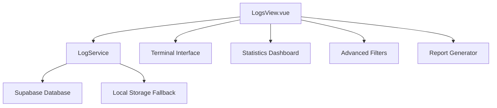

# 📊 Sistema Avançado de Logs - GestãoZe

<div align="center">

[](#)
[](#)
[](#)

**Sistema completo de monitoramento, auditoria e análise de logs com interface terminal profissional**

</div>

---

## 🎯 **Visão Geral**

O Sistema Avançado de Logs do GestãoZe é uma solução profissional para monitoramento, auditoria e análise de eventos do sistema. Oferece uma interface terminal avançada, comandos administrativos, relatórios técnicos e monitoramento em tempo real.

### ✨ **Características Principais**

- 🖥️ **Interface Terminal Profissional** com auto-complete e histórico
- 📊 **Dashboard de Estatísticas** em tempo real
- 🔍 **Filtros Avançados** por categoria, severidade, usuário e período
- 📈 **Relatórios Técnicos** automatizados em markdown
- 🛡️ **Segurança RLS** com políticas granulares
- ⚡ **Performance Otimizada** com índices especializados
- 🔄 **Monitoramento em Tempo Real** com atualizações automáticas
- 🧹 **Limpeza Automática** de logs antigos

---

## 🏗️ **Arquitetura do Sistema**

### **Camadas de Componentes**



### **Estrutura da Tabela**

| Campo | Tipo | Descrição |
|-------|------|-----------|
| `id` | BIGSERIAL | Identificador único |
| `user_id` | TEXT | ID do usuário |
| `username` | TEXT | Nome do usuário |
| `action` | TEXT | Ação executada |
| `resource` | TEXT | Recurso afetado |
| `resource_id` | TEXT | ID do recurso específico |
| `details` | JSONB | Detalhes da ação |
| `severity` | TEXT | Nível de severidade |
| `category` | TEXT | Categoria da ação |
| `timestamp` | TIMESTAMPTZ | Data/hora do evento |
| `execution_time` | INTEGER | Tempo de execução (ms) |
| `status` | TEXT | Status da operação |
| `error_message` | TEXT | Mensagem de erro |

---

## 🚀 **Configuração e Instalação**

### **1. Configuração do Banco de Dados**

Execute o script SQL para criar a tabela e configurações:

```sql
-- Execute este comando no Supabase SQL Editor
\i sql/create_logs_table.sql
```

### **2. Verificação da Instalação**

No console do navegador (F12):

```javascript
// Diagnóstico completo
await window.LogSystemInitializer.runFullDiagnostic()

// Criar dados de exemplo
await window.LogSystemInitializer.createSampleLogs()
```

### **3. Configurações de Ambiente**

Certifique-se de que as variáveis estão configuradas:

```env
VITE_SUPABASE_URL=your-supabase-url
VITE_SUPABASE_ANON_KEY=your-anon-key
```

---

## 🖥️ **Interface Terminal**

### **Comandos Disponíveis**

| Comando | Parâmetros | Descrição | Exemplo |
|---------|------------|-----------|---------|
| `help` | - | Lista todos os comandos | `help` |
| `logs` | `--limit N`, `--severity LEVEL` | Exibe logs recentes | `logs --limit 20 --severity error` |
| `stats` | `--days N` | Estatísticas do sistema | `stats --days 7` |
| `users` | - | Lista usuários ativos | `users` |
| `status` | - | Status do sistema | `status` |
| `search` | `--query TEXTO` | Busca nos logs | `search --query "login"` |
| `export` | `--format FORMAT`, `--days N` | Exporta dados | `export --format json --days 30` |
| `backup` | - | Inicia backup | `backup` |
| `monitor` | `--category CAT` | Monitor em tempo real | `monitor --category auth` |
| `clear` | - | Limpa terminal | `clear` |

### **Exemplos de Uso**

```bash
# Buscar todos os erros dos últimos 3 dias
logs --severity error --limit 50

# Estatísticas detalhadas da última semana
stats --days 7

# Buscar logs de autenticação
search --query "login"

# Exportar dados em CSV
export --format csv --days 15

# Status do sistema em tempo real
status
```

---

## 📊 **Dashboard de Estatísticas**

### **Métricas Principais**

- **Problemas Críticos**: Eventos de severidade crítica
- **Taxa de Erro**: Percentual de erros e eventos críticos
- **Tempo Médio**: Tempo médio de execução das operações
- **Total de Logs**: Volume total de eventos registrados

### **Distribuições**

- **Por Severidade**: info, warning, error, critical, debug
- **Por Categoria**: auth, crud, system, security, performance, user, api, database, command
- **Por Usuário**: Top usuários mais ativos
- **Por Recurso**: Recursos mais acessados

---

## 🔍 **Filtros Avançados**

### **Tipos de Filtro**

1. **Categoria**: auth, crud, system, security, performance, user, api, database, command
2. **Severidade**: info, warning, error, critical, debug
3. **Período**: Data/hora de início e fim
4. **Busca de Texto**: Pesquisa em ações, detalhes e mensagens de erro
5. **Status**: success, failed, pending

### **Combinação de Filtros**

Os filtros podem ser combinados para consultas específicas:

```javascript
// Exemplo de query complexa
{
  category: ['auth', 'security'],
  severity: ['error', 'critical'],
  startDate: '2024-01-01T00:00:00Z',
  endDate: '2024-01-31T23:59:59Z',
  search: 'login failed'
}
```

---

## 📈 **Sistema de Relatórios**

### **Relatório Técnico Profissional**

O sistema gera automaticamente relatórios técnicos completos incluindo:

#### **Seções do Relatório**

1. **Sumário Executivo**
   - Período de análise
   - Volume de eventos
   - Indicadores principais

2. **Métricas Operacionais**
   - Taxa de erro e advertências
   - Incidentes críticos
   - Tempo médio de resposta
   - Análise de performance

3. **Distribuições**
   - Por severidade
   - Por categoria
   - Por usuário
   - Por recurso

4. **Análise Temporal**
   - Timeline de eventos
   - Picos de atividade
   - Padrões sazonais

5. **Eventos Críticos**
   - Lista de incidentes críticos
   - Recomendações de ação
   - Análise de impacto

6. **Conformidade e Segurança**
   - Auditoria de acessos
   - Integridade dos dados
   - Operações administrativas

7. **Recomendações Técnicas**
   - Ações preventivas
   - Otimizações sugeridas
   - Políticas de segurança

### **Formatos de Exportação**

- **Markdown**: Para documentação técnica
- **JSON**: Para integração com outras ferramentas
- **CSV**: Para análise em planilhas

---

## 🛡️ **Segurança e Auditoria**

### **Row Level Security (RLS)**

O sistema implementa políticas RLS rigorosas:

- **SELECT**: Apenas administradores e gerentes
- **INSERT**: Usuários autenticados podem criar logs
- **UPDATE**: Apenas administradores
- **DELETE**: Apenas administradores, logs > 90 dias

### **Auditoria Automática**

Todos os eventos são automaticamente registrados:

- **Autenticação**: Login, logout, falhas de acesso
- **CRUD**: Criação, leitura, atualização, exclusão
- **Sistema**: Backup, manutenção, configurações
- **Segurança**: Tentativas de acesso, violações
- **Performance**: Tempos de execução, gargalos

### **Compliance**

- **LGPD**: Logs de acesso a dados pessoais
- **SOX**: Controles internos e auditoria
- **ISO 27001**: Gestão de segurança da informação

---

## ⚡ **Performance e Otimização**

### **Índices Especializados**

```sql
-- Índices principais
CREATE INDEX idx_logs_timestamp ON logs(timestamp DESC);
CREATE INDEX idx_logs_severity_timestamp ON logs(severity, timestamp DESC);
CREATE INDEX idx_logs_category_timestamp ON logs(category, timestamp DESC);

-- Índices GIN para busca em JSON
CREATE INDEX idx_logs_details_gin ON logs USING GIN (details);
CREATE INDEX idx_logs_metadata_gin ON logs USING GIN (metadata);
```

### **Estratégias de Performance**

1. **Paginação Otimizada**: Cursor-based para grandes volumes
2. **Cache Inteligente**: Redis para consultas frequentes
3. **Particionamento**: Por data para tabelas grandes
4. **Compressão**: JSONB para dados estruturados

### **Limpeza Automática**

```sql
-- Executa limpeza de logs > 90 dias
SELECT cleanup_old_logs(90);
```

---

## 🔧 **Monitoramento em Tempo Real**

### **Recursos Disponíveis**

- **Atualizações Automáticas**: A cada 10 segundos
- **Alertas Visuais**: Para eventos críticos
- **Notificações Push**: Para administradores
- **Dashboard Responsivo**: Adapta-se a diferentes telas

### **Configuração de Alertas**

```javascript
// Configurar alertas personalizados
logService.setupAlerts({
  criticalErrors: true,
  failureRate: 5, // %
  responseTimeThreshold: 1000 // ms
})
```

---

## 📚 **API de Programação**

### **LogService Methods**

```typescript
// Criar log
await logService.createLog({
  action: 'user_action',
  resource: 'products',
  details: { productId: 123 },
  category: 'crud',
  severity: 'info'
})

// Buscar logs
const { data, total } = await logService.getLogs({
  limit: 50,
  severity: ['error', 'critical']
})

// Estatísticas
const stats = await logService.getLogStatistics(30)

// Executar comando
const result = await logService.executeCommand('stats', ['--days', '7'])

// Gerar relatório
const report = await logService.generateTechnicalReport(30)
```

### **Interceptadores Automáticos**

```typescript
import { useLogInterceptor } from '@/services/logService'

const { logAction, logError } = useLogInterceptor()

// Log de ação
logAction('create_product', 'products', { name: 'Novo Produto' })

// Log de erro
logError(new Error('Database connection failed'), 'database_connection')
```

---

## 🧪 **Testes e Diagnósticos**

### **Ferramentas de Debug**

```javascript
// Console do navegador (F12)

// Diagnóstico completo
await window.LogSystemInitializer.runFullDiagnostic()

// Verificar tabela
await window.LogSystemInitializer.checkLogTableExists()

// Criar dados de exemplo
await window.LogSystemInitializer.createSampleLogs()

// Verificar RLS
await window.LogSystemInitializer.checkRLSPolicies()
```

### **Testes Automatizados**

```bash
# Executar testes unitários
npm run test:logs

# Testes de integração
npm run test:integration

# Testes de performance
npm run test:performance
```

---

## 🚨 **Troubleshooting**

### **Problemas Comuns**

#### **Erro: "Tabela não encontrada"**

```sql
-- Solução: Execute o script de criação
\i sql/create_logs_table.sql
```

#### **Erro: "Permissão negada"**

```sql
-- Verificar RLS e políticas
SELECT tablename, rowsecurity FROM pg_tables WHERE tablename = 'logs';
```

#### **Performance lenta**

```sql
-- Verificar índices
SELECT indexname FROM pg_indexes WHERE tablename = 'logs';

-- Recriar estatísticas
ANALYZE logs;
```

#### **Logs não aparecem na interface**

```javascript
// Verificar no console
await window.LogSystemInitializer.runFullDiagnostic()
```

### **Logs de Depuração**

```javascript
// Ativar logs de debug
localStorage.setItem('debug_logs', 'true')

// Ver logs detalhados no console
console.log(await logService.getLogs({ limit: 10 }))
```

---

## 📋 **Manutenção e Administração**

### **Rotinas Recomendadas**

#### **Diária**
- ✅ Verificar dashboard de métricas
- ✅ Revisar alertas críticos
- ✅ Monitorar performance

#### **Semanal**
- ✅ Gerar relatório técnico
- ✅ Analisar tendências de erro
- ✅ Verificar usuários mais ativos

#### **Mensal**
- ✅ Executar limpeza de logs antigos
- ✅ Otimizar índices
- ✅ Backup completo
- ✅ Revisar políticas de segurança

### **Scripts de Manutenção**

```sql
-- Limpeza automática (últimos 90 dias)
SELECT cleanup_old_logs(90);

-- Estatísticas da tabela
SELECT
    count(*) as total_logs,
    min(timestamp) as oldest_log,
    max(timestamp) as newest_log
FROM logs;

-- Reindexação
REINDEX TABLE logs;
```

---

## 🎯 **Roadmap e Melhorias Futuras**

### **Versão 2.1.0** (Próxima)
- [ ] **Alertas por Email/Slack**
- [ ] **Dashboard com Gráficos Avançados**
- [ ] **API REST para Integrações**
- [ ] **Machine Learning para Detecção de Anomalias**

### **Versão 2.2.0**
- [ ] **Clustering para Alta Disponibilidade**
- [ ] **Data Warehouse Integration**
- [ ] **Compliance Automática (GDPR, LGPD)**
- [ ] **Mobile App para Monitoramento**

### **Versão 3.0.0**
- [ ] **Microserviços Architecture**
- [ ] **Real-time Stream Processing**
- [ ] **AI-Powered Insights**
- [ ] **Advanced Analytics**

---

## 💡 **Dicas e Boas Práticas**

### **Para Desenvolvedores**

1. **Use os interceptadores** para logging automático
2. **Defina categorias específicas** para melhor organização
3. **Inclua contexto relevante** nos detalhes
4. **Use níveis de severidade apropriados**
5. **Teste os logs** durante o desenvolvimento

### **Para Administradores**

1. **Configure alertas** para eventos críticos
2. **Monitore as métricas** regularmente
3. **Gere relatórios** periodicamente
4. **Mantenha logs limpos** com rotinas de manutenção
5. **Use filtros** para análises específicas

### **Para Auditoria**

1. **Documente configurações** de segurança
2. **Mantenha histórico** de mudanças
3. **Revise acessos** regularmente
4. **Exporte dados** para análise externa
5. **Implemente controles** internos

---

## 🏆 **Conclusão**

O Sistema Avançado de Logs do GestãoZe representa uma solução empresarial completa para monitoramento, auditoria e análise de eventos. Com sua interface profissional, comandos avançados e relatórios técnicos, oferece todas as ferramentas necessárias para manter a operação segura, eficiente e em conformidade.

<div align="center">

### 🚀 **Sistema Totalmente Operacional**

[](#)
[](#)
[](#)

**Desenvolvido com ❤️ pela equipe GestãoZe**
*Versão 2.0.0 - Sistema de Logs Profissional*

</div>

---

*Este documento foi gerado automaticamente pelo Sistema de Documentação GestãoZe*
*Última atualização: 26/09/2025*